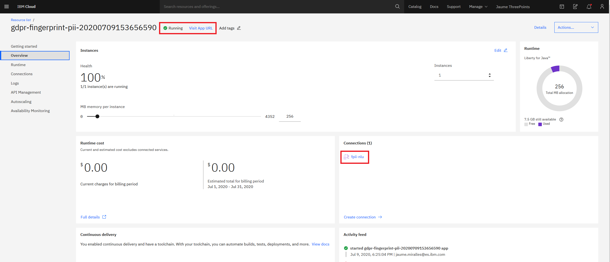
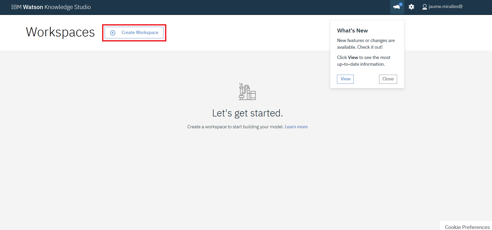
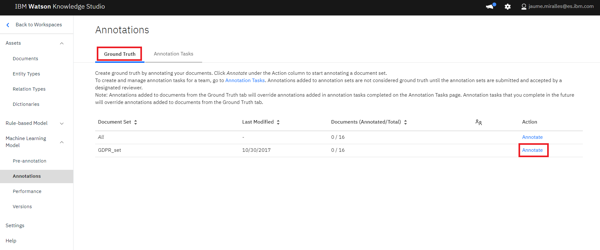
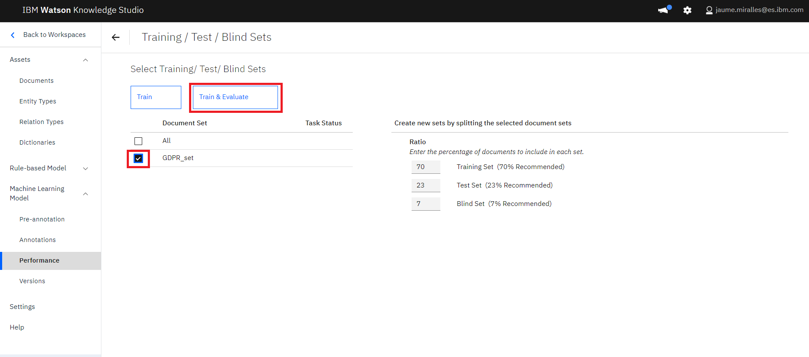
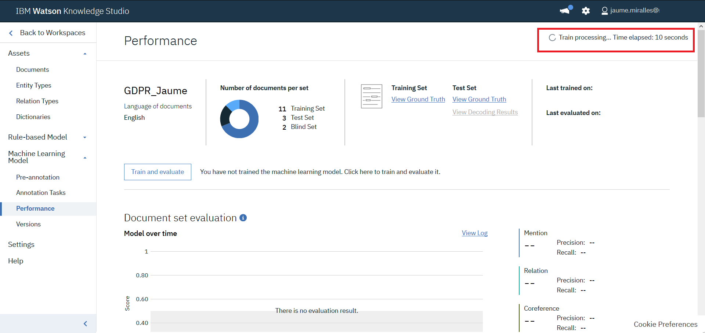
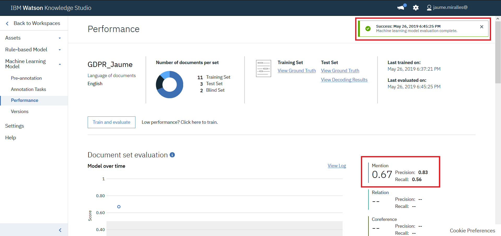
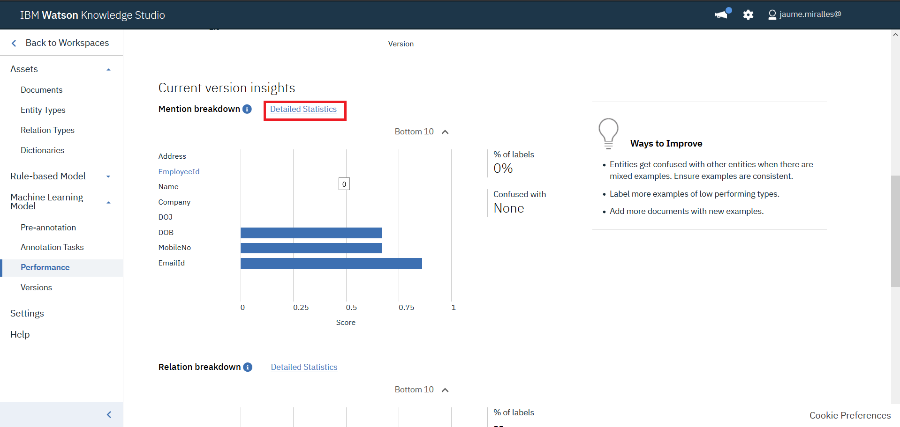
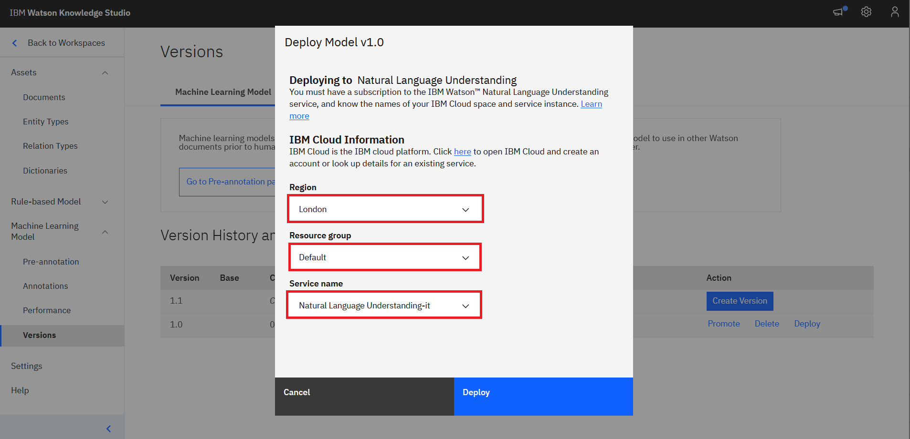

# Fingerprinting personal data from unstructured documents

General Data Protection Regulation (GDPR) is a relatively new regulation in EU which came into effect in May 2018. This new regulation applies to those organizations, including those outside EU, which collect and process personal data. It aims to give more control to individuals over usage of their personal data.

Right to forget - Under the new GDPR, organizations around the world must not only protect personal data but also forget personal data on request from individuals.

When a customer requests that all his or her personal data be deleted, then an organisation
needs to identify all the documents where the customer's personal data reside. This
code pattern addresses the need to identify the personal data from the provided documents.
Also, we will see how to assign a confidence score for the personal data that indicates
the confidence level in identifying an individual uniquely as part of the code pattern.

Let us try to understand this with an example chat transcript as below<br />

```
Rep: This is Thomas. How can I help you?
Caller: This is Alex. I want to change my plan to corporate plan
Rep: Sure, I can help you. Do you want to change the plan for the number from which you are calling now?
Caller: yes
Rep: For verification purpose may I know your date of birth and email id
Caller: My data of birth is 10-Aug-1979 and my email id is alex@gmail.com
Rep: Which plan do you want to migrate to
Caller: Plan 450 unlimited
Rep: Can I have your company name and date of joining
Caller: I work for IBM and doj 01-Feb-99
Rep: Ok.. I have taken your request to migrate plan to 450 unlimited. You will get an update in 3 hours. Is there anything else that I can help you with
Caller: No
Rep: Thanks for calling Vodaphone. Have a good day
Caller: you too
```

Personal Data extracted from the above text: <br />

```
Name: Alex
Date of birth: 10-Aug-1979
Email id: alex@gmail.com
Company: IBM
Date of joining: 01-Feb-99
```

Also the confidence score is calculated

```
Confidence score: 0.7
```


This code pattern gives you a step by step instructions for:
- Building a custom model using Watson Knowledge Studio (WKS) and having Natural Language
Understanding (NLU) use that model for personal data extraction.
- Using regular expressions, in addition to NLU, to extract personal data from unstructured
text.
- Configuring pre-identified personal data with weightage and coming up with a score
representing the confidence level of identifying an individual using the personal data
identified.
- Viewing the score and the personal data identified in a tree structure for better
visualization.
- Consuming the output of this code pattern by other applications.

# Flow
<br/><br/>
1 – Viewer passes input text to Personal Data Extractor.<br/>
2 – Personal Data Extractor passes the text to NLU.<br/>
3 – Personal Data extracted from the input text. NLU uses custom model to provide the response.<br/>
4 – Personal Data Extractor passes NLU Output to Regex component.<br/>
5 – Regex component uses the regular expressions provided in configuration to extract personal data which is then augmented to the NLU Output.<br/>
6 – The augmented personal data is passed to scorer component.<br/>
7 – Scorer component uses the configuration to come up with a overall document score and the result is passed back to Personal Data Extractor component.<br/>
8 – This data is then passed to viewer component.<br/>


# Included Components
* [Watson Knowledge Studio](https://cloud.ibm.com/docs/services/knowledge-studio/index.html#wks_overview_full):
  A tool to create a machine-learning model that understands the linguistic nuances,
  meaning, and relationships specific to your industry or to create a rule-based model
  that finds entities in documents based on rules that you define.

* [Watson Natural Language Understanding](https://www.ibm.com/watson/services/natural-language-understanding/):
  An IBM Cloud service that can analyze text to extract meta-data from content such as
  concepts, entities, keywords, categories, sentiment, emotion, relations, semantic
  roles, using natural language understanding.

* [Liberty for Java](https://cloud.ibm.com/docs/runtimes/liberty/index.html#liberty_runtime):
Develop, deploy, and scale Java web apps with ease. IBM WebSphere Liberty Profile is
a highly composable, ultra-fast, ultra-light profile of IBM WebSphere Application Server
designed for the cloud.


# Watch the Overview Video

[](https://youtu.be/NiBCa3EtCr0)


# Steps
1. [Prerequisites](#1-prerequisites)
2. [Concepts used](#2-concepts-used)
3. [Application deployment](#3-application-deployment)
4. [Develop Watson Knowledge Studio model](#4-develop-watson-knowledge-studio-model)
5. [Deploy WKS model to Watson Natural Language Understanding](#5-deploy-wks-model-to-watson-natural-language-understanding)
6. [Update model_id in the GDPR application environment variables](#6-Update-model_id-in-the-GDPR-application-environment-variables)
7. [Analyze results](#7-analyze-results)
8. [Consuming the output by other applications](#8-consuming-the-output-by-other-applications)


## 1. Prerequisites
- IBM Cloud account: If you do not have an IBM Cloud account, you can create an account [here](https://cloud.ibm.com/).
- Basic knowledge of building models in WKS: The user must possess basic knowledge
  of building model in WKS in order to build a custom model. Check getting started documentation [here](https://cloud.ibm.com/docs/services/knowledge-studio/tutorials-create-project.html#wks_tutintro)


## 2. Concepts used
### 2.1 Data extraction methods
We have to define what personal data (e.g. Name, Email id) we would want to extract. This is done in two ways in this code pattern. <br/>
A) Using Custom model built using Watson Knowledge Studio (WKS) and <br/>
B) Using regular expressions. Details of how these are used are explained in subsequent
sections.<br/><br/>
### 2.2  Configuration
We use configuration to extract personal data. Personal data are classified into different
categories. Each category is assigned a weight. Also we specify what personal data
belongs to which category. <br/>

A sample configuration is as shown below <br/>

```
Categories: Very_High,High,Medium,Low
Very_High_Weight: 50
High_Weight: 40
Medium_Weight: 20
Low_Weight: 10
Very_High_PIIs: MobileNumber,EmailId
High_PIIs: Person,DOB
Medium_PIIs: Name,DOJ
Low_PIIs: Company
regex_params: DOB,DOJ
DOB_regex: (0[1-9]|[12][0-9]|3[01])[- /.](Jan|Feb|Mar|Apr|May|Jun|Jul|Aug|Sep|Oct|Nov|Dec)[- /.](19|20)\d\d
DOJ_regex: (0[1-9]|[12][0-9]|3[01])[- /.](Jan|Feb|Mar|Apr|May|Jun|Jul|Aug|Sep|Oct|Nov|Dec)[- /.]\\d\\d
```

If you want to change configuration, then follow the below template

```
Categories: <new set of categories which are comma separated>. e.g. Categories: MyCategory1,MyCategory2,MyCategory3
<category_name>_Weight: Weightage for each category. e.g. MyCategory1_Weight: 40
<category>_PIIs: Personal data (Entity types). e.g. MyCategory1_PIIS: EmailId, Employee Id
regex_params: Entity types which have to be extracted using regular expressions. e.g. regex_params:
Date
<regex_param>_regex: Regular expression using which an entity needs to be extracted from text e.g. Date_regex:
(0[1-9]|[12]\[0-9]|3[01])
```

### 2.3 Brief description of application components
#### 2.3.1 Personal Data Extractor component:
Personal Data Extractor component is the controller which controls the flow of data
between all the components. It also integrates with NLU.
#### 2.3.2 Regex component:
Regex component parses the input text using the regular expressions provided in the
configuration files to extract personal data. Regular expressions are used to extract
personal data to augment NLU output.
#### 2.3.3 Scorer component:
Scorer component calculates the score of a document, which is between 0 and 1, based
on the personal data identified and the configuration data. It uses the below algorithm<br/>

```
Let score be 0
    For each category{
	   cat_weight = weightage for the category
	   cat_entity_types = list of entity types for the category
	   for each cat_entity_types{
	      score = score +( ( cat_weight/100 ) * ( 100 - score ) )
	   }
    }
score = score / 100; // to make it between 0 and 1
```

#### 2.3.4 Viewer component:
Viewer component is the user interface component of the application. User can browse
a file, containing chat transcript, and submit to personal data extraction component.
After processed personal data are then shown in a tree view, along with the
overall confidence score. <br/>
<!--

-->

## 3. Application & Service Deployment
### 3.1 Deploy Java Liberty application to IBM Cloud
You can deploy the Java Liberty application using the `Deploy to IBM Cloud` button or
using manual steps (see the original source for manual steps).
<br/><br/><br/>
Click `Deploy to IBM Cloud` button above to deploy the application to IBM Cloud. <br/>
<br/>[](https://cloud.ibm.com/devops/setup/deploy?repository=https://github.com/jaumemir/gdpr-fingerprint-pii.git)

<br/><br/>It will take some time and may ask you to log in to IBM Cloud if you are not loggedin already. 
You would be presented with a toolchain view. Check that the selected region is either `London`, `Frankfurt` or `Dallas` and under `Delivery Pipeline` select `New` button to create a new API Key. It fill in the empty slots. Ensure they are correct and finally press the `Create` button. <br/>
<br/><br/><br/>
The screen will show an appearance similar to this:
<br/><br/><br/><br/>
Press on the `Delivery Pipeline`. A new screen will show the application being compiled and deployed. Once both stages get a green status (`Stage passed`), select the `View Console` small link in the `Deploy Stage`.
The application console opens. It should show a green status (`Running`) on the top. Ensure that the application
is started and that a NLU service is created and bound to the application just deployed. (check similar status as in the following picture)
<br/><br/><br/><br/>
<br/>

### 3.2 Deploy Watson Knowledge Studio (WKS) service in IBM Cloud
Press the `Catalog` link on the top bar and navigate to the service catalog.
Select `AI` in the categories and select `Knowledge Studio`
<br/><br/><br/><br/>
Selected region such as `London`, `Frankfurt` or `Dallas`and ensure the pricing plan is `Lite` and press the `Create` button.
Once the new screen is shown, select `Manage` at the left, and press the `Launch Watson Knowledge Studio` button.
You should reach the following screen.
<br/><br/><br/><br/>

## 4. Develop Watson Knowledge Studio model
### 4.1 Concepts
#### 4.1.1 Type Systems
You can learn more about Type Systems [here](https://cloud.ibm.com/docs/services/knowledge-studio/typesystem.html#typesystem).
Type Systems can either be created or imported from an already created Type Systems
json file. It is left to user to create his or her own Type systems or use a Type Systems
json file provided in this repository. If you wish to import the Type Systems json
file, then download the file named `TypeSystems.json` under the folder `WKS` in this
repository to your local file system. The json file has entity types such as Name, PhoneNo, EmailId, Address.
You can edit/add/delete entity types to suit your requirement.<br/>
*For the guided activity, download the provided Type System json file to import it later*

#### 4.1.2 Documents
You can learn more about Documents [here](https://cloud.ibm.com/docs/services/knowledge-studio/documents-for-annotation.html#wks_t_docs_intro).
We will need a set of documents to train and evaluate the WKS model. These documents
will contain the unstructured text from which we will identify personal data. Refer
to some of the sample document files under the folder `SampleChatTranscripts`. To train a good
WKS model with high precission and recall, a large and varied set of sample real documents are needed. <br/>
To complete this exercise, let us consider a smaller set of documents.

You can either have your own set of documents or use the ones provided in this git repository.
It is placed under `WKS/Documents.zip`. If you decide to use the documents provided in
this repo, then download the file to your local file system.<br/>
*For the guided activity, download the provided Documents.zip file to import it later*

### 4.2 Create Workspace
If you are not already there, open the WKS tool.
- Click `Create Workspace`.<br/>
<br/><br/><br/>
- In the `Create Workspace` pop up window, enter the name of the new Workspace. Leave `English`and the other options as they are. Click `Create`<br/>
<br/><br/><br/>


### 4.3 Import type system
- After the project is created, click `Entity Types` on the left navigation menu, under `Assets` and click `Upload`<br/>
<br/><br/><br/>
- Click the upload icon and browse to the file `WKS/TypeSystems.json` file that was downloaded from git repository<br/>
<br/><br/><br/>
- The selected file gets listed in the popup window. Click `Upload`<br/>
<br/><br/><br/>
- The 8 imported types are listed as below. If you wish, you can add or edit entities.<br/>
<br/><br/><br/>


### 4.4 Import Documents
- Click `Documents` on the left navigation menu, under `Assets` and click `Upload Document Sets`<br/>
<br/><br/><br/>
- Click the import icon on the popup window and browse to and select `Documents.zip` file that was downloaded from github repository earlier. It is also possible to drag & drop the file in the gray area.<br><br>
- Click `Upload`
<br/><br/><br/>
- 16 documents are imported under the `GDPR_Set` document set.


### 4.5 Human Annotation
- Click the link in the `go to Annotations page.` text or navigate to the `Annotation Tasks` menu under `Machine Learning Model` in the left menu. A new screen is presented.
<br/><br/><br/>
- Click `Annotate`<br/>
- Click `OK` for any Alert message that pops up
- Ground truth editor opens up. Here you can select each document one by one to annotate all the documents. Click on any of the documents and click `OK` for any Alert message that may pop up.<br/>
<br/><br/><br/>
- From the documents select an entry that you want to be extracted from the document as entities. Then click on the entity type on the right hand side of the screen
- Similarly do this for all the entities in the document. Note that the idea is to only annotate **"customer names"** and **"customer companies"** and **not** *"agent names"* or *"telco company"*. That is, the type **"Names"** in reality means **"Customer Names"**<br/>
<br/><br/><br/>
- Once all the keywords are mapped to entity types, click `Save` to save the changes. Then click on `Open document list`, select another document and repeat above steps for all the documents in the set. It will take some time.<br/><br/>
- At this point, all the documents should be annotated and completed.
- Check in the document list that all the documents have the icon for "annotated".
<br/><br/>
<br/><br/>

### 4.6 Model Training and Evaluation

- Click `Performance` menu under `Machine Learning Model` in the left menu. A new screen is presented.<br/>
<br/><br/><br/>
- We will create a new model, so click `Train and Evaluate` button.
- Under `Document Set` select the `GDPR_set` whose annotation was completed in previous steps.<br/>
<br/><br/><br/>
- Click `Train & Evaluate`.
- Train and Evaluate process takes place.<br/>
<br/><br/><br/>
- It will take a few minutes for this step to complete (about 25 minutes)<br/>
<br/><br/><br/>
- Once training is completed, lets review the evaluation figures. Apart of the overall precision and recall, WKS offers more detailed information. Press `Detailed Statistics`.<br/>
<br/><br/><br/>
- In the new screen, a summary of quality statistics for each type can be observed. The triangle warning icon indicates that the F1 value is less than the fixed value, 0.5. If the value is N/A, means there are not enougth annotations. Both incidences should be fixed in a real project.<br/>
<br/><br/><br/>
- Inspect the confusion matrix and the statistics for the training set to understand how the model behaves.<br/><br/>


## 5. Deploy WKS model to Watson Natural Language Understanding
- Click `Versions` menu under `Machine Learning Model` in the left menu. A new screen is presented.<br/>
<br/><br/><br/>
- Clic `Create Version`. Enter any meaningful description for the snapshot. Click `OK`.<br/>
<br/><br/><br/>
- Snapshot is created.<br/>
<br/><br/><br/>
- Click `Deploy` to deploy on the NLU service that was created in earlier steps in this document. Click `Deploy`.<br/>
<br/><br/><br/>
- Select `Natural Language Understanding`. Click `Next`.<br/>
<br/><br/><br/>
- Select your IBM Cloud Region, Resource Group and NLU service instances. Click `Deploy`.<br/>
<br/><br/><br/>
- WKS model should get deployed on the NLU. Take note of the Model Id. You will need it later. Click `OK`.<br/>
<br/><br/><br/>
- Model is deployed to NLU.<br/>
<br/><br/><br/>
- Press `Status` link, and validate when the deployment has been completed.
<br/><br/><br/>


## 6. Update model_id in the GDPR application environment variables
- Navigate to [IBM Cloud Resource List screen](https://cloud.ibm.com/resources) . Click on the GDPR application that is deployed.<br/>
<br/><br/><br/>
- Click `Runtime`.<br/>
<br/><br/><br/>
- Click `Environment Variables` and scroll down to user defined variables.<br/>
<br/><br/><br/>
- Update the model id against `wks_model` entry. Ensure there are no whitespaces before or after the `model_id` Also here is where you will update all your configuration data. Update/edit all the configuration data as required. Finally verify that all other configuration parameters are correct. Click `Save`.<br/>
<br/><br/><br/>
- The application restarts. When the application is running again, we are ready to use the application to extract personal data and score them from unstructured text.<br/>
<br/><br/>


## 7. Analyze Results
- From the github repo for this Pattern, download sample chat transcripts, from
  the folder `SampleChatTranscripts`, on to your local file system
- Open the application URL from a browser.<br/>
<br/><br/><br/>
- Click `Choose File`. On the popup window browse to any chat transcript that you downloaded in 2 steps above and select it. Click `Open`
- Initially you see a collapsed tree view as below.<br/>
<br/><br/><br/>
- Click on nodes to expand and collapse the nodes. Full tree view looks as below.<br/>
<br/><br/><br/>


## 8. Consuming the output by other applications
- This application exposes two REST interfaces <br />
/rest/personaldata/forviewer and <br/>
/rest/personaldata/forconsumer<br/>
The two have differently formatted output for different usage purposes. While the former is used by viewer, in D3 tree view, the latter is more generic and can be invoked by any application for consumption. <br/>
Viewer Output JSON looks as in the below image<br/>
<br/><br/><br/>
Generic Output JSON looks as in the below image<br/>
<br/><br/><br/>


# Learn more
- **Artificial Intelligence Code Patterns:** Enjoyed this Journey? Check out our other [AI Code Patterns](https://developer.ibm.com/technologies/artificial-intelligence/).
- **AI and Data Code Pattern Playlist:** Bookmark our [playlist](https://www.youtube.com/playlist?list=PLzUbsvIyrNfknNewObx5N7uGZ5FKH0Fde) with all of our Code Pattern videos


# License

This code pattern is licensed under the Apache Software License, Version 2.  Separate third party code objects invoked within this code pattern are licensed by their respective providers pursuant to their own separate licenses. Contributions are subject to the [Developer Certificate of Origin, Version 1.1 (DCO)](https://developercertificate.org/) and the [Apache Software License, Version 2](https://www.apache.org/licenses/LICENSE-2.0.txt).

[Apache Software License (ASL) FAQ](https://www.apache.org/foundation/license-faq.html#WhatDoesItMEAN)
